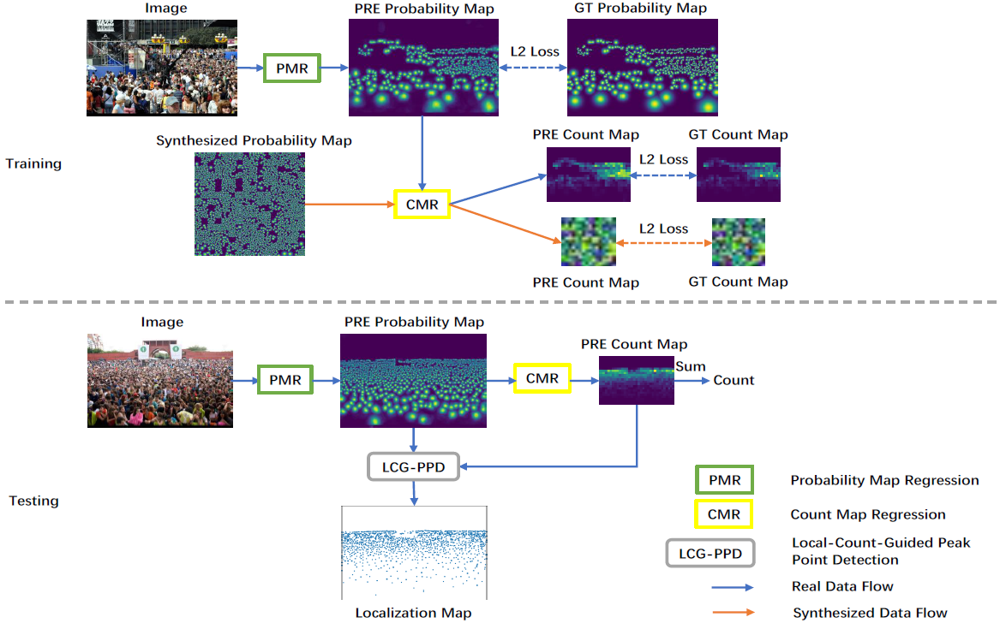

# Decoupled_Two-stage_Counting

This repository includes the official implementation of D2CNet for crowd counting, presented in our paper:

**[Decoupled Two-Stage Crowd Counting and Beyond](website here)**

IEEE Transactions on Image Processing(TIP), 2020

Jian Cheng<sup>1,&dagger;</sup>, Haipeng Xiong<sup>1,&dagger;</sup>, Hao Lu<sup>1</sup>, Zhiguo Cao<sup>1</sup>

<sup>1</sup>Huazhong University of Science and Technology

<sup>&dagger;</sup> equal contribution

### Model Structure
<p align="left">
  
</p>

## Installation
The code has been tested on Python 3.7.6 and PyTorch 1.5.0. Please follow the official instructions to configure your environment. See other required packages in `requirements.txt`.

## Data Preparation
1. Download the official ShanghaiTech and UCF_QNRF dataset under `./data`. Resize images in UCF_QNRF to ensure the longer side is not greater than 1920.
```
cd prepare_dataset
python normalize_QNRF.py
```

2. Generate synthesized dataset by running `generate_synthesized_dataset/main.m` in Matlab.

3. Generate probability maps, density maps and dot maps. It may take several days to prepare the UCF_QNRF dataset, so it's better to split it into several parts and process them in parallel.
```
python make_dataset.py
```

4. Generate json files of training and testing data.
```
cd ..
python prepare_dataset/filepath2json.py ./data/shanghaitech/part_A_final/train_data/images/ part_A_train.json
```

## Training
```
python train.py [path to training json] [path to testing json] [GPU] [TASK]
```

## Testing
Download the pretrained models. 
PartA [BaiduYun](https://pan.baidu.com/s/1x-Mu1bKbcQI48bmszLrFGA) (code: 3qal) 
PartB [BaiduYun](https://pan.baidu.com/s/10PHLUu_FXWjY1gOT6iCKYw) (code: ybfp) 
QNRF [BaiduYun](https://pan.baidu.com/s/1nA3EaiVRqKiNjqKL4f04-Q) (code: xrjq) 

```
python train.py --pre [path to pretrained model] [path to training json] [path to testing json] [GPU] [TASK] --mode [1 or 2]
```
Mode 1 is for counting evaluation, and mode 2 is for localization evaluation.

## Permission
The code are only for non-commercial purposes. Copyrights reserved.

Contact: 
Jian Cheng (jian_cheng@hust.edu.cn)
