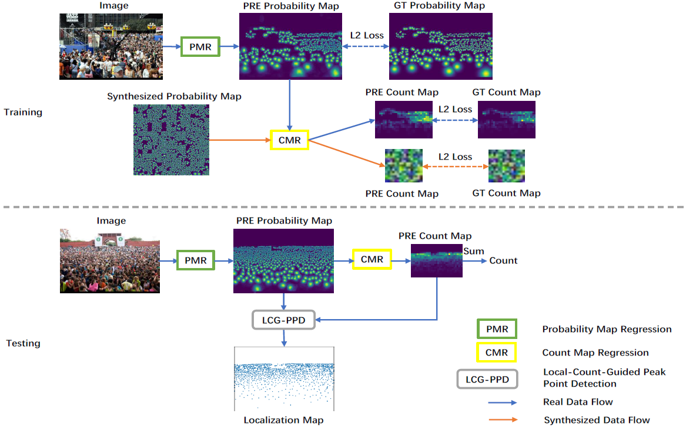
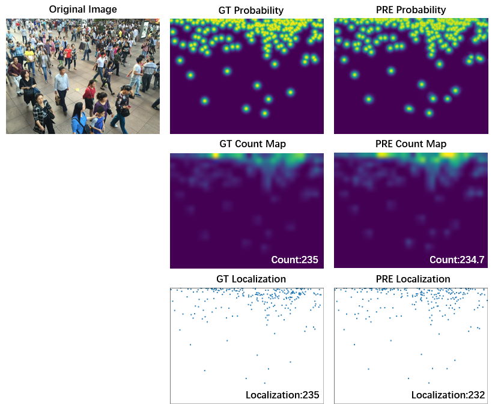

# Decoupled Two-Stage Counting

This repository includes the official implementation of D2CNet for crowd counting and localization, presented in our paper:

**[Decoupled Two-Stage Crowd Counting and Beyond](https://ieeexplore.ieee.org/document/9347700)**

IEEE Transactions on Image Processing, 2021

Jian Cheng<sup>&dagger;</sup>, Haipeng Xiong<sup>&dagger;</sup>, Zhiguo Cao, Hao Lu

Huazhong University of Science and Technology

<sup>&dagger;</sup> equal contribution

### Overview
<p align="left">
  
</p>

### Visualization
<p align="left">
  
</p>

### Highlights
- **New representation of crowd**: We introduce the concept of the probability map which describes the probability of a point being an object;
- **Simple and effective:** With only a basic network architecture and simple training procedures, D2CNet obtains state-of-the-art counting and localization performance;
- **Multifunctional:** D2C framework not only unifies object counting and object localization but also enables synthesized data augmentation and flexible counting error diagnosis.

### Installation
The code has been tested on Python 3.7.6 and PyTorch 1.5.0. Please follow the official instructions to configure your environment. See other required packages in `requirements.txt`.

### Data Preparation
1. Download the official ShanghaiTech and UCF_QNRF dataset under `./data`. Resize images in UCF_QNRF to ensure the longer side is not greater than 1920.
```
cd prepare_dataset
python normalize_QNRF.py
```

2. Generate synthesized dataset by running *generate_synthesized_dataset/main.m* in Matlab.

3. Generate probability maps, density maps and dot maps. It may take several days to prepare the UCF_QNRF dataset, so it's better to split it into several parts and prepare them in parallel.
```
python make_dataset.py
```

4. Generate json files of training and testing data.
```
cd ..
python prepare_dataset/filepath2json.py ./data/shanghaitech/part_A_final/train_data/images/ part_A_train.json
```

### Training
```
python train.py part_A_train.json part_A_test.json 0 0
```

### Testing
Download the pretrained models to the main folder. 

PartA (MAE: 55.673, MSE: 87.161) [BaiduYun](https://pan.baidu.com/s/1x-Mu1bKbcQI48bmszLrFGA) (code: 3qal) 

PartB (MAE: 6.367, MSE: 10.716) [BaiduYun](https://pan.baidu.com/s/10PHLUu_FXWjY1gOT6iCKYw) (code: ybfp) 

QNRF (MAE: 81.698, MSE: 137.925) [BaiduYun](https://pan.baidu.com/s/1nA3EaiVRqKiNjqKL4f04-Q) (code: xrjq) 

```
python train.py --pre partA.pth.tar part_A_train.json part_A_test.json 0 0 --mode 1
```
Mode 1 is for counting evaluation, and mode 2 is for localization evaluation.

### Permission
The code are only for non-commercial purposes. Copyrights reserved.

Contact: 
Jian Cheng (jian_cheng@hust.edu.cn) and Hao Lu (hlu@hust.edu.cn)
